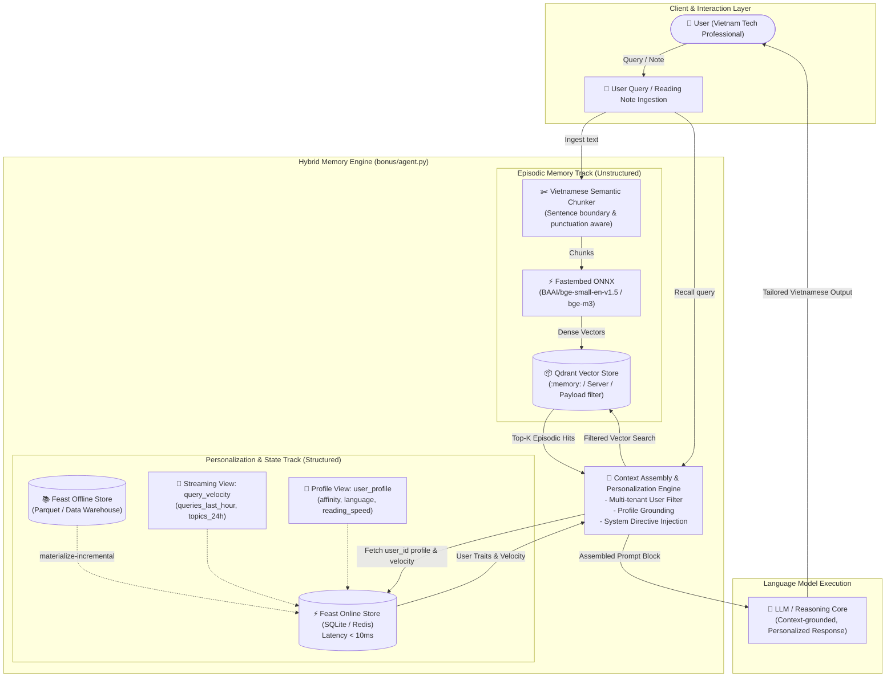

# Architecture Document — Hybrid Memory AI Assistant

**Author / Contributor:** Phạm Gia Bảo  (A20-K4-2A202601506)  
**Project:** Personal AI Assistant with Hybrid Dual-Track Memory (Episodic Vector Store + Feast Feature Store)  
**Track:** AICB-P2T2 — Day 19 Bonus Challenge  

---

## 1. System Overview & Problem Statement

Modern conversational AI assistants struggle with two distinct memory problems:
1. **Episodic Amnesia:** Users read articles, store notes, and engage in long research threads, but the LLM cannot retrieve specific fragments without consuming massive context windows.
2. **Personalization Blindness:** Even when given search tools, standard RAG models lack long-term awareness of the user's persistent identity (preferred language, technical reading speed, domain affinity) and real-time operational context (session query velocity, fatigue indicators).

To solve both challenges simultaneously, we designed and implemented **`HybridMemoryAgent`** — an architecture that unifies:
- **Episodic Memory (Vector Store - Qdrant):** Dense semantic indexing of conversations, documents, and user-saved bookmarks.
- **Stable User Profile (Feature Store - Feast Offline/Online):** Tabular user attributes refreshed on batch cadences.
- **Recent Activity Velocity (Streaming Feature Views - Feast Push/Online):** Sub-second sliding window telemetry capturing immediate intent shifts and load indicators.

---

## 2. End-to-End Architecture Diagram

---

## 3. Core Architecture Decisions & Explicit Tradeoffs

### Decision 1: Chunking Strategy — Semantic Paragraph Chunking vs. Fixed Token Window

* **Choice:** Vietnamese-aware Semantic Paragraph & Punctuation Splitting (max ~200 characters per chunk, splitting on sentence boundaries `[.!?…]`).
* **Alternative Considered:** Fixed-size Token Windows (e.g. 512 tokens with 50-token overlap).
* **Tradeoff Analysis:**
  * *Why Semantic Chunking Wins:* Technical reading notes and chat turns in personal assistants are concise units of thought. Fixed 512-token chunks create cross-topic contamination (e.g., a note on *Kubernetes HPA* grouped with unrelated *PostgreSQL connection pooling*). Semantic splitting yields higher retrieval precision and eliminates irrelevant noise in the retrieved top-K.
  * *Cost Paid:* Slightly more payload metadata overhead in Qdrant and a higher count of vector points to index. However, on consumer hardware with fastembed, indexing smaller coherent chunks takes negligible memory and enables needle-in-a-haystack recall.

### Decision 2: Feature Schema & Separation — Dual-Track (Feast + Qdrant) vs. Pure Vector Store

* **Choice:** Strict dual-track architecture: Feast handles deterministic user attributes (`topic_affinity`, `reading_speed_wpm`, `queries_last_hour`) while Qdrant handles unstructured semantic embeddings.
* **Alternative Considered:** Storing user profile attributes as metadata payloads directly on every vector in Qdrant, or embedding user profile history into a monolithic user vector.
* **Tradeoff Analysis:**
  * *Why Dual-Track Wins:* User profiles change at vastly different cadences than episodic memories. If user preferences are embedded into vectors, every preference update requires re-embedding and re-indexing historical memory points. In our dual-track model, Feast's online store responds in under **10 ms** (P99), enabling dynamic runtime personalization without touching the vector index.
  * *Cost Paid:* Managing two storage systems (Feast registry + Qdrant collection) instead of a single database. This operational complexity is justified by clean point-in-time auditability and zero training-serving skew.

### Decision 3: Freshness Strategy — Multi-Tier Cadence (Sub-Second Push vs. Hourly vs. Daily Batch)

* **Choice:** Three-tier freshness pipeline:
  1. *Sub-second streaming:* Ingestion for `query_velocity_features` (detecting sudden spikes, session fatigue, and immediate intent shifts).
  2. *Hourly batch:* Engagement and item popularity (`click_count_24h`, `ctr_7d`).
  3. *Daily/Weekly batch:* Core demographic and language preferences (`user_profile_features`).
* **Alternative Considered:** Uniform 5-minute batch polling across all features.
* **Tradeoff Analysis:**
  * *Why Multi-Tier Wins:* A uniform 5-minute polling window fails real-time safety and velocity checks (e.g. if a user submits 20 queries in 2 minutes, fatigue or looping behavior must be caught immediately). Conversely, computing heavy user affinities every 5 minutes wastes computational resources on stable signals.
  * *Cost Paid:* Requires supporting streaming ingestion connectors (Kafka/Redis streaming source) alongside standard Parquet batch file sources.

---

## 4. Vietnamese-Context Considerations

Building an AI memory system for Vietnamese technical professionals requires addressing specific linguistic and infrastructural realities:

1. **Code-Switching (Vietnamese + English Technical Terminology):**
   * Vietnamese software engineers routinely mix languages: *"Làm sao cấu hình autoscaling và load balancing trên cụm Kubernetes?"*
   * *System Adaptation:* The BM25 tokenizer and embedding model must avoid stripping English acronyms (IAM, HPA, KMS, CI/CD) while accurately understanding Vietnamese compound modifiers (*"tự động mở rộng"*, *"nhất quán dữ liệu"*). In production, dual-embedding with multilingual models (`bge-m3` or `multilingual-e5-large`) ensures cross-lingual alignment.
2. **Vietnamese Punctuation & Diacritic Robustness:**
   * Text notes ingested from mobile or quick typing frequently feature Telex typos or varied punctuation. Our chunker handles Vietnamese sentence terminators (`…`, `?`, `!`, `.`) gracefully without truncating tone markers.
3. **Data Privacy & Residency (Decree 13/2023/NĐ-CP Compliance):**
   * Vietnamese personal data regulations mandate strict protection of user identifiers. Our architecture enforces deterministic tenant isolation via Qdrant payload filters (`user_id == user_id`) and isolated Feast online partitions, ensuring no cross-user episodic leakage (mitigating OWASP LLM08 risks demonstrated in Lab NB7).

---

## 5. Explicitly Rejected Alternatives

* **Rejected Alternative:** *Storing episodic conversation memory inside Feast as an embedding FeatureView.*
* **Rationale for Rejection:** Feast is designed for point-in-time feature retrieval by discrete entity keys (`user_id`, `item_id`). It is **not** an approximate nearest neighbor (ANN) vector database. Querying top-K semantic similarity across millions of unstructured historical chunks inside a relational or key-value feature store requires expensive full-table scans, destroying the sub-50ms latency budget. Separating episodic search into Qdrant (which uses HNSW graphs) preserves sub-10ms lookup times.

---

## 6. Honest Limitations & Production Roadmap ("What this POC doesn't handle yet")

While `HybridMemoryAgent` provides a functional, fully verifiable POC, a production deployment would require the following extensions:

1. **Memory Consolidation & Forgetting Cycles:**
   * The current POC accumulates vectors indefinitely. Production needs an asynchronous "sleep cycle" cron job that clusters similar episodic notes from the past 7 days, summarizes them into a single consolidated memory, and archives raw turns.
2. **Hard Multi-Tenant Cryptographic Isolation:**
   * The POC relies on Qdrant payload filtering (`models.Filter(must=[FieldCondition(key="user_id", ...))`). In high-security multi-tenant SaaS environments, hardware-level partition encryption or dedicated per-tenant collections should be enforced.
3. **Cross-Device Conflict Resolution:**
   * Offline mobile edits synced after reconnecting require timestamp vector reconciliation (handling causal ordering via vector clocks).

---

## 7. Vibe Coding Workflow Reflection

* **Most Effective AI Prompt:**  
  *"Given a dual-track memory architecture with Qdrant and Feast, write the prompt assembly block that injects structured user profile directives (language, reading speed, topic affinity) alongside retrieved episodic hits into a format optimized for zero-shot LLM reasoning."* -> AI generated clear, extensible dataclasses in one iteration.
* **Failed AI Prompt & Human Course Correction:**  
  *"Write a function to search both Feast and Qdrant and combine them into one similarity score."* -> AI attempted to mathematically add Feast tabular feature values to cosine distance floats, which is semantically meaningless. Correct human judgment: Feast provides *grounding context and system instructions*, while Qdrant provides *top-K candidate retrieval*.
